# llm-pdf-summarization
Using LLM to summarize PDF. 

Try out the [Web demo](https://huggingface.co/spaces/hermanda/pdf-summarizer), integrated into [Huggingface Spaces 🤗](https://huggingface.co/spaces) using [Gradio](https://github.com/gradio-app/gradio). 

# How does it work?
This app uses langchain and `GPT-4o-mini` in the background.

```mermaid
graph LR
    A[📄 Upload Document] --> B[✂️ Split into Chunks]
    B --> C[🤖 Send to LLM]
    C --> D[📝 Generate Summary]
```


## Usage

### Local
```
uv venv --python=3.12
source .venv/bin/activate
python app.py
```
Now you can visit http://0.0.0.0:3000 and enjoy the app.

### Docker
```
docker build -t pdf-summarizer-app .
docker run -p 3000:3000 --name pdf-summarizer -e OPENAI_API_KEY=your_openai_api_key_here pdf-summarizer-app
```
Now you can enjoy the app on http://localhost:3000. 

To remove the image
```
docker rm pdf-summarizer
```
